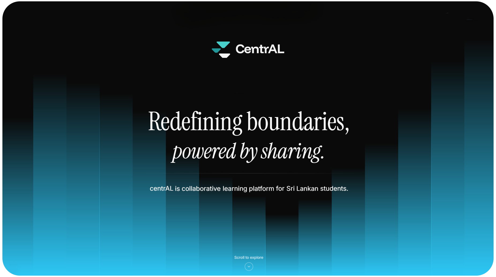

  

<h1 align="center">centrAL</h1>

  

---

## About centrAL

centrAL is a modern, collaborative learning platform specifically designed for Sri Lankan G.C.E Advanced Level students. Our mission is to democratize access to quality educational resources and create a supportive community where students can learn, collaborate, and excel together.

### Key Features

-  **Subject-Focused Learning** - Comprehensive resources for A/L subjects
-  **Collaborative Environment** - Study groups, peer discussions, and knowledge sharing
-  **Interactive Learning** - Engaging content with interactive exercises and multimedia resources
-  **AI-Assisted Learning** - Personalized study recommendations and intelligent content suggestions
-  **Secure Authentication** - Safe and personalized learning experience
-  **Responsive Design** - Seamless experience across all devices

## Contributing

We welcome contributions from the community! Please read our [Contributing Guidelines](CONTRIBUTING.md) before getting started.

1. Fork the repository
2. Create your feature branch (`git checkout -b feat/amazing-feature`)
3. Commit your changes (`git commit -m 'Add some amazing feature'`)
4. Push to the branch (`git push origin feature/amazing-feature`)
5. Open a Pull Request

---

  Made with ❤️ for Sri Lankan students

